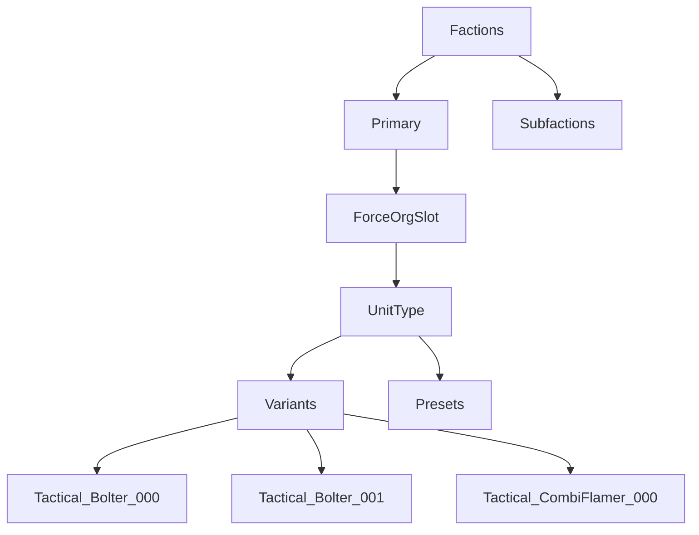

# Contributing

This is volunteer work done by the community on their own time.

## Guidelines & Code of Conduct

1. Don't be a dick

## Directory Structure

## Conventions
0. Use [Markdown](https://www.markdownguide.org/basic-syntax/) for documentation
0. Use `.svg` format images. These are vectors, meaning it just stores the shape. They can be coloured and scale without getting pixelated.
0. Indies start at `0`
0. Use triple digit padding for image files to support variants, i.e. `000` -> `999`
0. Use underscores in names, i.e. `Tactical_Bolter_001`
0. Use references to a unit where it exists as an option inside another faction instead of duplicating the shape for `Castellax` models in the Legion & Solar Auxilia folders, create a filepath that points to `Mechancium\Troops\Castellax`
0. Subfactions are used for units which appear **exclusively** in that subfaction, _i.e. `Palatine Blades`, `Magos Reductor`, `Horus Lupercal`, ..._
0. Images directly from Games Workshop are preferred
0. Use side-profiles for vehicles
0. Pintle options and non-visible upgrades like `Chem-muntions` or `meltabombs` are not included as variants
0. Where options are taken, ordering is
    1. Weapons
    2. Wargear
    2. Vehicles
0. Grouped assets are used for common combinations, and should be saved under `Presets`, i.e. `Tacticals_Vexilia_Rhino_000.svg`
0. Attribute links and references, i.e. `Source name - author`

## Reviews

Changes must be done via Pull Requests - there will be a Review done to evaluate the proposed changes, and ensure they meet the guidelines. This is to keep the project clean & usable, don't take it personally, respond appropriately. 

File conflicts mean you've made a change to the same file as someone else, and you'll have to choose which "change" to keep.